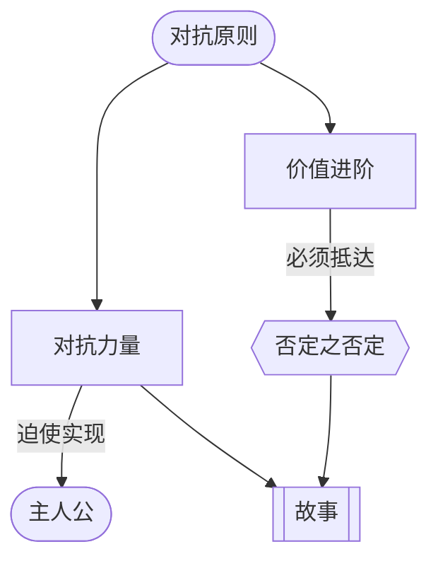

# 对抗原则（The Principle of Antagonism）

> English: [[wiki/en/principles/principle-of-antagonism|English]]

## 原则
**主人公及其故事在智识上的吸引力和情感上的感染力，只能达到对抗力量（[[forces-of-antagonism]]）逼迫他们达到的高度。** 麦基称之为"故事设计中最重要、也最少被理解的法则"，也是绝大多数剧本失败的主要原因。

## 麦基的论证
人性本质上是保守的。若非必须，我们不会多耗一份力气、不冒一份险、不做一次改变。作家唯一能迫使主人公（[[protagonist]]）做出更深、更真选择的杠杆，就在故事的**负向**一侧。正向是对负向的回应，而非自发生成。

把主人公放到激励事件（[[inciting-incident]]）那一刻称一称：他的意志、理智、情感、社会、身体能力之和，必须显得被对抗力量（内在、个人、制度、环境）的总量压过。他仍**有机会**，但**并不占优**。失去了这份不对称，就没有值得观看的征程。

## 实践应用
- 故事薄弱，根因几乎总在对抗薄弱。不要让主人公更讨喜，而要让负向更致命。
- 识别中心价值，将其沿价值进阶（[[value-progression]]）递降：**正面 → 矛盾 → 对立 → 否定之否定**。
- 将对抗布置在所有冲突层面（[[levels-of-conflict]]），而非只占一层。激励事件处，其总量必须令人窒息。
- "对抗力量"不等于反派。某些类型（动作、恐怖）里，出色的大反派是福音；但一部故事也可以在没有具体反派的情况下拥有巨大对抗。
- 在故事某处抵达极限。停留于对立之前的故事可以令人满意，但永远不会崇高。

## 电影案例
- **[[casablanca]]** 卡萨布兰卡——在自由、爱、节操三重价值上同时从否定之否定起步，再一路攀回正面。
- **[[chinatown]]** 唐人街——对抗不断叠加，直到否定之否定（与乱伦所生女儿再度乱伦）被揭开；主人公因此无法获胜。
- *超人*（Mario Puzo 的设计）——仅凭氪石不够：他让超人面临"两害相权取其轻"（新泽西还是加州）和一个"两难全"的抉择（父亲的戒律与罗伊丝的生命），把近乎神的角色重新推回弱者。
- *飞越未来*（*Big*）——直接跳到否定之否定（孩子困在成人生活里），再照亮不成熟的每一道灰度。

## 违反的后果
- **对抗力量薄弱**：主人公任何时刻都显得能应付，张力积累不起，人物深度也无从被逼出。
- **停在对立**：故事读起来像典型类型片——合格，但永远无法令人难忘。
- **对抗只占单一层面**：反派无制度、无环境、无内在的呼应；主人公打赢了，故事也随之断气。
- **以主人公为先的设计**：作者把精力耗在让主人公可爱，而非让对抗毁灭性；结果是扁平、动机不足的角色。

## 来源
- 《故事》第14章
