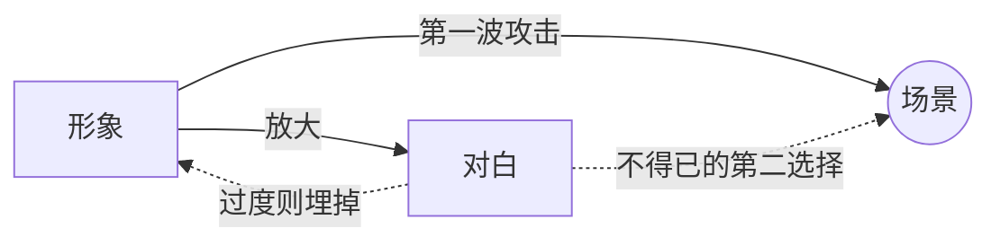

# 无声剧本（The Silent Screenplay）

> English: [[wiki/en/principles/silent-screenplay|English]]

## 原则
**形象优先，对白居次。** 凡能用视觉表达承载的时刻，就不要写对白。"对白简省，映衬以主要视觉的叙事"才有力量；被对白塞满的声轨会把视觉抹掉。

## 麦基的论证
电影是 80% 视觉、20% 听觉。镜头对一切虚假或生硬都有 X 光透视。对白是剧本的**最后一层**，因为**过早写对白会扼杀创意**——作家会爱上自己的台词，拒绝重构场景。边际效益递减：对白越多，每句力道越小。

希区柯克："剧本写完、**对白加完**，就可以开拍了。"

## 实践应用
- **每场戏的第一问**：能不能不用对白把这一刻写出来？
- **对白最后写**。哪怕到处理稿之后；不要把"剧本"误作"对白"。
- **保持简省**。短句、悬念句形态。参见对白（[[dialogue]]）与悬念句（[[suspense-sentence]]）。
- **让描写承担场景**。参见描写（[[description]]）。
- **播种影像系统**。参见影像系统（[[image-systems]]）。
- **信任观众**。"展示而非讲述"就是尊重观众的智识。

## 电影案例
- *沉默*（伯格曼）——侍者诱惑：餐巾落下、缓慢嗅闻、悠长呼吸。零对白，满能量。
- *2001 太空漫游*——长段落的纯视觉叙事。
- 卓别林的作品——整个默片时代都证明了无须一句话能讲多少故事。

## 违反的后果
- **对白驱动的剧本**：像带描写的广播剧。
- **带图有声书**：被旁白灌满的影片——麦基警告这是电影向"经典连环画"的退化。
- **文学化过度**：炫技的句子跳出页面；演员现场删掉。
- **说话头像**：长台词没有被行动／反应打断。

## 来源
- 《故事》第18章（无声剧本）
- 《故事》第6章（母原则：戏剧化而非讲述 [[dramatize-dont-explain]]）
