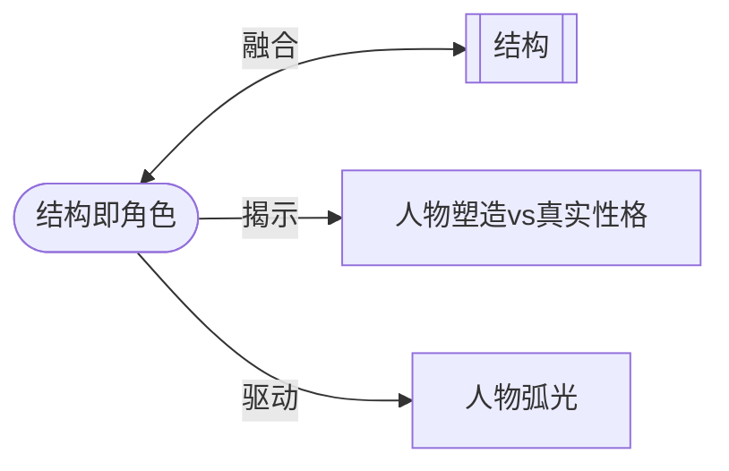

# 结构即角色（Structure Is Character）

> English: [[wiki/en/principles/structure-is-character|English]]

## 原则

结构就是角色；角色就是结构。它们是同一回事。结构的功能是提供逐步递增的压力，迫使角色做出越来越困难的选择，揭示他们的真实本性。角色的功能是带来令人信服地演绎这些选择所必需的人物塑造特质。改变一个，就改变另一个。

## 概念关系图

## 麦基的论证

"角色驱动的故事"是冗余的说法——所有故事都是角色驱动的。事件设计和角色设计互为镜像。事件结构由角色在压力下的选择创造，而角色则通过他们选择如何在压力下行动而被揭示和改变。

如果你改变事件设计，就改变了角色：一个在初稿中说真话、在二稿中说谎的主人公是一个完全不同的人，即使他的人物塑造保持不变。如果你改变深层角色，就必须重新发明结构：一个改变了的角色必须做出新的选择，采取不同的行动，活出另一个故事——*他的*故事。

## 实践应用

- 永远不要将"角色"与"情节"分开发展——它们不可分割
- 用这个问题检验每个事件：这迫使了什么选择，那个选择揭示了什么？
- 用这个问题检验每个角色：这种本性会产出什么事件？
- 调整人物塑造（表面特征）以支持高潮选择的可信性——情节比人物塑造重要，但结构和真实性格是一体的

## 电影案例

- **[[the-verdict|大审判]]**（*The Verdict*）— 结构（针对天主教会的医疗事故案）被设计来创造恰好能将弗兰克·加尔文从自我毁灭弧向救赎的递增压力
- **《贪婪》**（*Greed*）— 莫哈维高潮要求人物塑造服务于高潮选择；主人公的年龄被调整以使沙漠追逐可信

## 违反的后果

当作者发展"有趣的角色"却没有结构性压力来揭示他们时，结果是有人物塑造而无角色——有表面而无深度。当作者设计精巧的情节却不考虑选择揭示了什么时，结果是有奇观而无意义。

## 来源

- 《故事》第5章，"结构与角色的功能"
