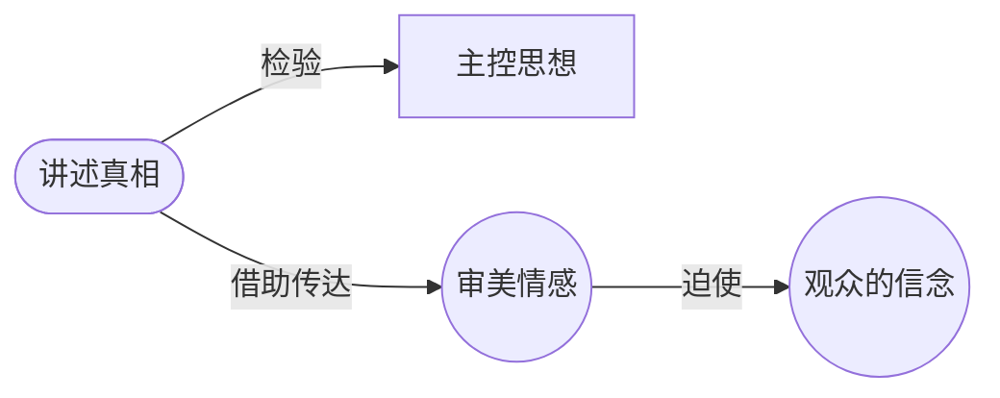

# 艺术家的责任是真相（The Artist's Responsibility Is Truth）

> English: [[wiki/en/principles/tell-the-truth|English]]

## 原则

我们没有责任治愈社会弊病、振奋精神，甚至没有表达内在自我的责任。我们只有一个责任：讲述真相。审视你的主控思想——如果你不相信它的意义，扔掉它重新开始。如果你相信，就尽一切可能让你的作品面世。"在一个充满谎言和骗子的世界里，一部诚实的艺术作品永远是一种社会责任行为。"

## 概念关系图

## 麦基的论证

每一个有效的故事都向观众发送一个带电荷的思想，通过审美情感的诱惑力量迫使人相信。柏拉图想要放逐叙事者，正是因为他们将思想隐藏在艺术的情感之中——被感受到的思想仍然是思想，它们的说服力是巨大的。作家是危险的人，柏拉图对此的判断是正确的。

但这种力量要求的是诚实，不是审查。"在追寻真理的过程中，我们必须甘愿承受最丑陋的谎言。"霍姆斯大法官主张我们必须信任思想的市场。没有任何文明因为其公民了解了太多真相而被摧毁。当权者恐惧的不是思想而是情感——艺术家通过揭露谎言和激发变革的热情来威胁权威。

## 实践应用

- 在定稿之前问自己："这是真相吗？我相信我故事的意义吗？"
- 艺术家在私人生活中可能说谎，但在创作时，他讲述真相
- 有勇气持有观点——"温吞、安抚的作家是一种折磨"
- 保持辩证的灵活性：诚实地接纳相反的、甚至令人厌恶的思想

## 来源

- 《故事》第6章，"意义与社会"
