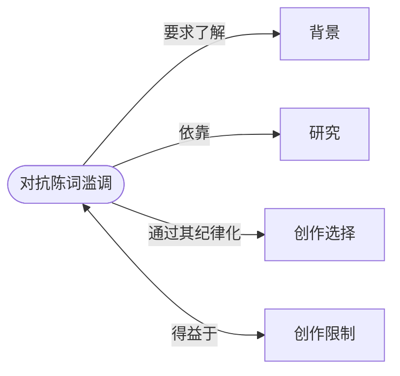

# 对抗陈词滥调（The War on Cliché）

> English: [[wiki/en/principles/war-on-cliche|English]]

## 原则

一切陈词滥调的根源都可以追溯到一件事：**作者不了解自己故事的世界。**当作者缺乏对虚构世界的深刻认知时，他们不可避免地从其他电影和小说中借用素材——加热文学剩饭。解药是通过[[research|研究]]获得对故事[[setting|背景]]的详尽知识，并通过有纪律的[[creative-choices|创作选择]]加以表达。

## 概念关系图

## 麦基的论证

现代观众是历史上最沉浸于故事的群体，一天之内消费的故事量相当于前几代人一周的量。当观众坐下来观看一部新作品时，他们已经吸收了数万小时的故事。当作者从准备不足的头脑中寻找素材却一无所获，转而从其他作品中搜刮创意时，陈词滥调就成为必然结果。观众不满的"全球性流行病"有且只有这一个明确的原因。

## 实践应用

1. **了解你的世界。** 通过记忆、想象和事实研究故事的背景，直到拥有统领性的知识——深入到没有任何相关问题能难倒你。
2. **让你的世界小而具体。** 有限的、可知的世界是原创性的前提。抵制模糊的诱惑。
3. **超量创作，然后筛选。** 以10:1或20:1的比例产出素材，然后只选择最忠于角色、最忠于世界、从未以这种方式呈现过的内容。
4. **不要相信第一个想法。** "灵感"通常只是从你头顶上随手抓取的第一个陈词滥调。

## 电影案例

- 麦基假设的"东区浪漫喜剧"——单身酒吧邂逅是第一个想法（陈词滥调）。有纪律的作者会产出十几个替代方案，或者深入挖掘单身酒吧的世界以找到其中的真实。

## 违反的后果

不了解故事世界的作者产出的作品是观众已经看过的：可预测的结局、回收的角色、借来的场景。结果就是观众的厌倦和不满——麦基在本章开头所诊断的"瘟疫"。"无论他们的才华如何，他们缺乏对故事背景及其所包含内容的深入理解。"

## 来源

- 《故事》第3章，"对抗陈词滥调"
