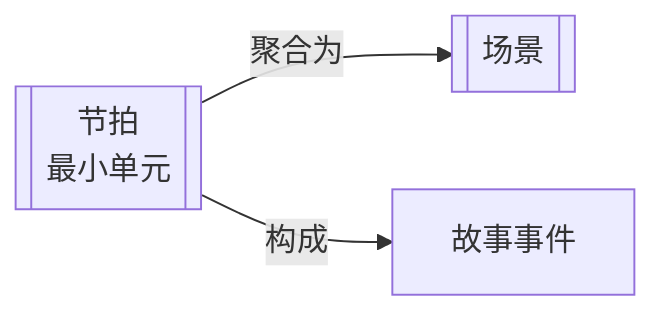

# 节拍（Beat）

> English: [[wiki/en/structures/beat|English]]

## 定义

节拍（Beat）是行动/反应中的行为交换。一个接一个的节拍，这些变化的行为塑造了场景的转变。注意不要与剧本对白中表示"短暂停顿"的[beat]标记混淆。

## 概念关系图

## 在故事层级中的位置

- **上一层级：** [[scene]]（场景）— 节拍构建场景；一系列节拍组成场景的弧线
- **下一层级：** 无 — 节拍是故事结构的最小元素
- **本层级：** 角色之间行动与反应的交换，在场景内部推动行为的转变

## 麦基的论述

麦基将节拍定义为讲故事的原子单位。每个场景都由一系列节拍构成——行为的明确转变，一个角色行动，另一个角色反应，创造出一种逐步升级的变化模式。没有清晰的节拍，场景就会变成静态的对话，而非动态的戏剧行动。

## 运作机制

每个节拍代表一种明显不同的行为。在一个场景中，节拍通过逐步升级的交换推进：角色可能从调侃转向侮辱，从威胁转向恳求，从恳求转向暴力。每一次转变都是一个新的节拍。场景的最后一个节拍往往与场景的转折点重合。

## 电影案例

- 麦基的"恋人分手"示意：六个节拍从调侃 → 侮辱 → 威胁/挑衅 → 恳求/嘲笑 → 暴力 → 决定结束关系逐步推进。每个节拍都是行动/反应行为的清晰转变。

## 与其他概念的关系

- [[scene]]（场景）— 节拍构建场景；场景的弧线由其节拍序列塑造
- [[story-event]]（故事事件）— 场景的最后一个节拍往往创造出转变场景价值的故事事件

## 常见错误

麦基警告不要写角色自始至终保持相同行为的场景。如果角色在开头争吵，结尾仍以同样方式争吵，没有明显的行为转变（节拍），场景就缺乏内部结构。

## 来源

- 《故事》第2章"结构谱系"
