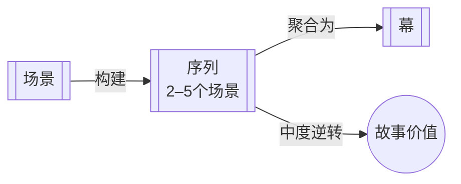

# 序列（Sequence）

> English: [[wiki/en/structures/sequence|English]]

## 定义

序列（Sequence）是一系列场景——通常两到五个——以比之前任何单个场景都更大的冲击力收尾。序列的封顶场景递送比序列内单个场景更强大、更决定性的变化。

## 概念关系图

## 在故事层级中的位置

- **上一层级：** [[act]]（幕）— 序列构建幕；封顶序列递送幕高潮
- **下一层级：** [[scene]]（场景）— 场景通过逐步升级的价值变化构成序列
- **本层级：** 一系列场景汇聚为一个序列高潮，其幅度大于单个场景的转变

## 麦基的论述

序列的存在是为了将场景组织成具有升级赌注的有意义的递进。虽然单个场景创造的是微小但重要的变化，序列的封顶场景却递送更强大、更决定性的变化。麦基建议为每个序列命名以明确其故事目的——例如"获得工作的序列"。

## 运作机制

麦基用一个三场景序列来阐释：（1）一位女性为关键的工作面试做准备，从自我怀疑转向自信；（2）她夜晚穿越中央公园，冒着生命危险幸存下来；（3）在派对上，她虽然狼狈不堪，但天然的魅力为她赢得了工作。每个场景转变各自的价值（自信、生存、社交成功），但三者组合成一个转变更大价值的序列：没有工作 → 得到工作。

## 电影案例

- 麦基的"获得工作"序列——三个场景（酒店、中央公园、派对）从自我怀疑经历致命危险到社交胜利，全部服务于一个总领价值：赢得工作
- 一个序列可以在单个场景中完成，但通过扩展来戏剧化呈现内在性格、人物关系和世界观

## 与其他概念的关系

- [[scene]]（场景）— 场景是序列的构建单元
- [[act]]（幕）— 序列构建幕，最具冲击力的序列递送幕高潮
- [[story-values]]（故事价值）— 序列的总领价值统辖其内部各场景的价值

## 常见错误

写出内部场景不朝着更大价值转变聚拢的序列。如果序列中的场景是断裂的或不升级的，序列就缺乏戏剧动力。

## 来源

- 《故事》第2章"结构谱系"
