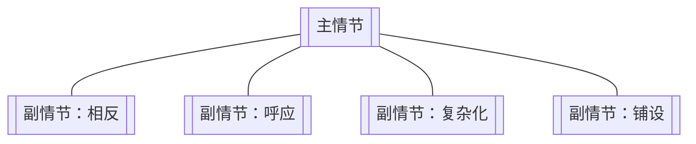

# 副情节（Subplot）

> English: [[wiki/en/structures/subplot|English]]

## 定义
**副情节**是嵌入主情节的次要故事线，有各自的主人公与欲望，承担四项功能之一：与主情节的主控思想**相反**、**呼应**、**复杂化**或**铺设**。

## 在故事层级中的位置
- **上一层级：** [[story-climax]]（故事高潮）— 副情节不得盖过主高潮。
- **平行：** [[act]]（幕）— 副情节拥有自身的幕结构，常被压缩。
- **下一层级：** [[scene]]（场景）— 构成单位相同。

## 麦基的论述
副情节不是填料。每条副情节都必须在脊椎上做功。四种合法用途：
1. **相反** — 副情节的[[controlling-idea]]（主控思想）与主线相反，赋予故事辩证分量。
2. **呼应** — 副情节以变奏放大主线思想。
3. **复杂化** — 副情节制造敌对，加料于主线。
4. **铺设** — 副情节安装主线日后所需之物（信息、关系、技能）。

## 电影案例
- *克莱默夫妇* — 父子副情节与抚养权主线彼此呼应。
- *卡萨布兰卡* — 拉兹洛／通行证副情节复杂化里克的欲望。

## 与其他概念的关系
- [[spine]]（故事脊椎）— 副情节须服务、而非抢戏。
- [[inciting-incident]]（激励事件）— 副情节的激励事件可在银幕外。
- [[controlling-idea]]（主控思想）— 副情节折射或挑战中心主控思想。

## 常见错误
- 四项功能一样未做的副情节——纯装饰。
- 副情节比主情节更抓人（结构失衡）。
- 副情节无高潮即被抛弃。

## 来源
- 《故事》第9章
